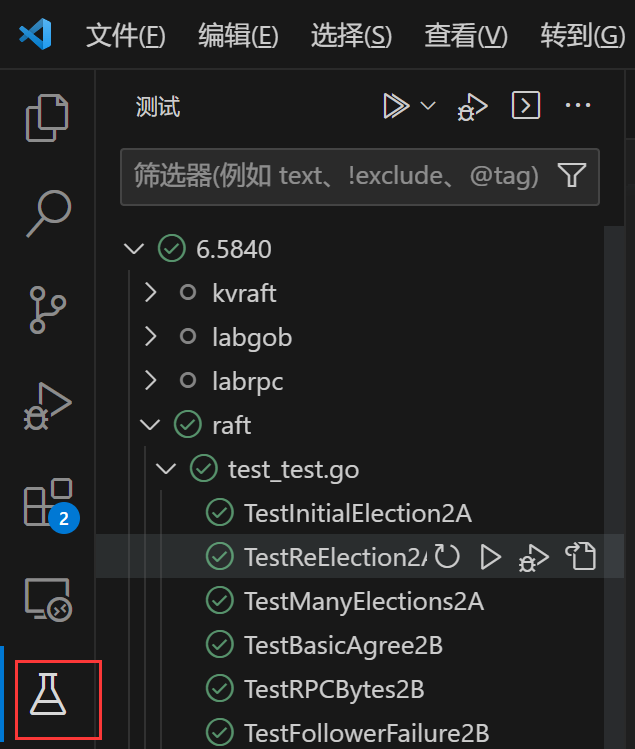

# Tutorial

关于 Raft 项目的一些实践上的解释说明。

## 环境配置

> 该部分很多内容和 DHT 项目环境配置相近，也可以结合 [DHT 配置文档](https://github.com/ACMClassCourse-2022/DHT-2023/blob/master/doc/tutorial.md)（Thanks to [@1024th](https://github.com/1024th)）。

### 系统环境

已知可以正常运行的系统环境：Linux, Mac, WSL2

**请注意，本项目无法在 WSL 1 上正常运行。** 如果你使用的 WSL 为 WSL 1 而非 WSL 2，请先[升级你的 WSL 版本](https://learn.microsoft.com/en-us/windows/wsl/install#upgrade-version-from-wsl-1-to-wsl-2)。

### IDE 环境

你可以使用 [GoLand](https://www.jetbrains.com/go/) 或 [VS Code](https://code.visualstudio.com/) 来编写你的项目。

#### 安装 Go

根据 Go [官方指南](https://go.dev/doc/install)安装最新版本即可（本项目最低 Go 版本要求为 1.15）。

项目仓库中已配置好了 GoModule（`src/go.mod` 和 `src/go.sum`），无需额外配置 GoModule 或 GoPath。

#### 配置 GoLand

如果使用 WSL，在 GoLand 中需要打开 WSL 中的目录来使用。

1. 配置 Go ROOT（路径为你刚才安装 Go 的路径）。
2. 在 Raft 仓库中配置 Go Test，测试种类选择 package，路径为 `6.5840/raft`，模式一栏为可以用正则表达式语法匹配相应测试点名称。

#### 配置 VS Code

1. 在[插件市场](https://marketplace.visualstudio.com/items?itemName=golang.go)中安装 Go 扩展。

2. 扩展安装后会提示安装若干 package，默认安装即可。

   > 在这一步可能会出现连接超时的问题，可以通过配置 Go 模块代理来解决：
   >
   > ```shell
   > go env -w GOPROXY=https://goproxy.cn,direct
   > ```

3. 推荐在 `settings.json` 中加入

   ```json
   "gopls": { "ui.semanticTokens": true },
   ```

   开启语义高亮，以获得更好的高亮体验。

## Go 语言学习

建议使用一天左右的时间粗略阅读官方教程（[英文版](https://go.dev/tour/welcome/1) / [中文版](https://tour.go-zh.org/welcome/1)），了解大致语法。后期可以边写边查阅。

关于并发部分：至少需要理解信道（channel）和互斥锁（`sync.Mutex`）。

> 推荐学习条件变量（`sync.Cond`）来优化部分轮询操作，见 [Go 文档](https://pkg.go.dev/sync#Cond) 或 [这里](https://geektutu.com/post/hpg-sync-cond.html)。

## Raft 算法学习

* Raft 论文：见仓库 `doc/` 下的 [raft-extended.pdf](raft-extended.pdf)。
* Raft 动画：http://thesecretlivesofdata.com/raft/
* 更多内容：<https://raft.github.io> ~~及自行上网查找~~。

## 实现部分

再次提醒，你的仓库应为 **PRIVATE** 类型。

### 课程 Lab 页面

MIT Lab 页面有很详细的引导，实现前请认真阅读：

- Lab 2: Raft: https://pdos.csail.mit.edu/6.824/labs/lab-raft.html
- Lab 3: K/V-Raft: https://pdos.csail.mit.edu/6.824/labs/lab-kvraft.html

关于具体任务：

- Lab 2：完善 `src/raft` 中的 `raft.go`（如果需要的话可以在 `util.go` 中增加适当的工具函数）；
- Lab 3：完善 `src/kvraft` 中的 `common.go`， `client.go` 与 `server.go` 三个文件。

**注意：你不应修改除了上述提到的五个文件以外的其它 Go 语言文件。**

### 实现辅助文档

* mit 助教总结：<https://thesquareplanet.com/blog/students-guide-to-raft/>
* mit 助教 Q/A：<https://thesquareplanet.com/blog/raft-qa/>
* 关于锁的建议：<https://pdos.csail.mit.edu/6.824/labs/raft-locking.txt>
* 关于 Raft 的结构的建议：
  * https://pdos.csail.mit.edu/6.824/labs/raft-structure.txt
  * <https://zhuanlan.zhihu.com/p/103849249>

`doc/` 中的[结构图](raft_diagram.pdf)可能对你也有所帮助。

## 关于 Lab 3

在写 Lab 3 前，推荐大家先学习一些分布式系统的基本理论知识（特别是一致性模型相关）。可以看看这门课的几次 lecture 的笔记：

- [6.5840 Lecture 1: Introduction](https://pdos.csail.mit.edu/6.824/notes/l01.txt)
- [6.5840 Lecture 9: Consistency, Linearizability](https://pdos.csail.mit.edu/6.824/notes/l-linearizability.txt)

实现细节参考 Lab 页面的 Hint 与 Raft paper 的 Section 8（<u>最后一段提到的优化方法可以不用实现</u>）。

## 测试方法

### 单次测试

- 命令行方法：在对应 Lab 的目录（Lab 2: `src/raft`; Lab 3: `src/kvraft`）下运行

  ```shell
  go test [-run <测试点名称关键字>] [-race] [-timeout=<时长>]
  ```

  -  `-run` ：使用该参数时，该指令将会运行**测试名称中含有给定关键字**的测试点，不使用时则运行所有测试点。
  - `-race`：含义见 Lab 2 页面。
  - `-timeout`：可以使用该参数设置时限（例如 `60s`，`6m`），不使用时默认为 `10m`。

- 插件方法：以 VS Code 为例，在左侧活动栏中找到“测试”图标，点入后可以选择运行相应的测试点。

  
  
  该插件的测试的默认 timeout 为 300s，需要时可以在设置中修改（对应 `go.testTimeout` 项）。

### 批量测试

由于并发程序本身执行顺序不一定，在一次测试中很可能暴露不出程序中存在的漏洞，故需要多次测试。

并发脚本已经放入到仓库的 `src/raft` 和 `src/kvraft` 目录中。使用方法：

```shell
./go-test-many.sh [测试次数] [并行数] [测试点名称关键字]
```

例如，运行 `./go-test-many.sh 2000 8 2C` 的含义是并行数为 8 且运行共 2000 次**测试名称中含有字符串 `2C`** 的测试点。并行数的默认值为本机逻辑处理器个数。

> 最后评测将采用相同的测试脚本，运行次数见 README 的评分政策。

根据经验，如果想要确保你的程序（几乎）完全正确，对于 Lab 2A 和 2B，你可能需要进行至少 1000 次测试；对于 Lab 2C, 2D, 3A 和  3B，你可能需要进行至少 4000 次测试。

## 调试指北

> https://pdos.csail.mit.edu/6.824/labs/guidance.html

由于并发程序的特性，建议使用输出 log 的方式来调试程序。

`src/raft/util.go` 中提供了 `DPrintf` 函数来帮助你输出 log，且该函数会自动在输出内容前加上时间戳（默认单位为秒）。在本次项目中，很多时候你可能需要查看更为精细的时间戳，此时可以将函数改为

```go
func DPrintf(format string, a ...interface{}) (n int, err error) {
	if Debug {
		log.SetFlags(log.LstdFlags | log.Lmicroseconds)
		log.Printf(format, a...)
	}
	return
}
```

来输出以微秒为单位的时间戳。